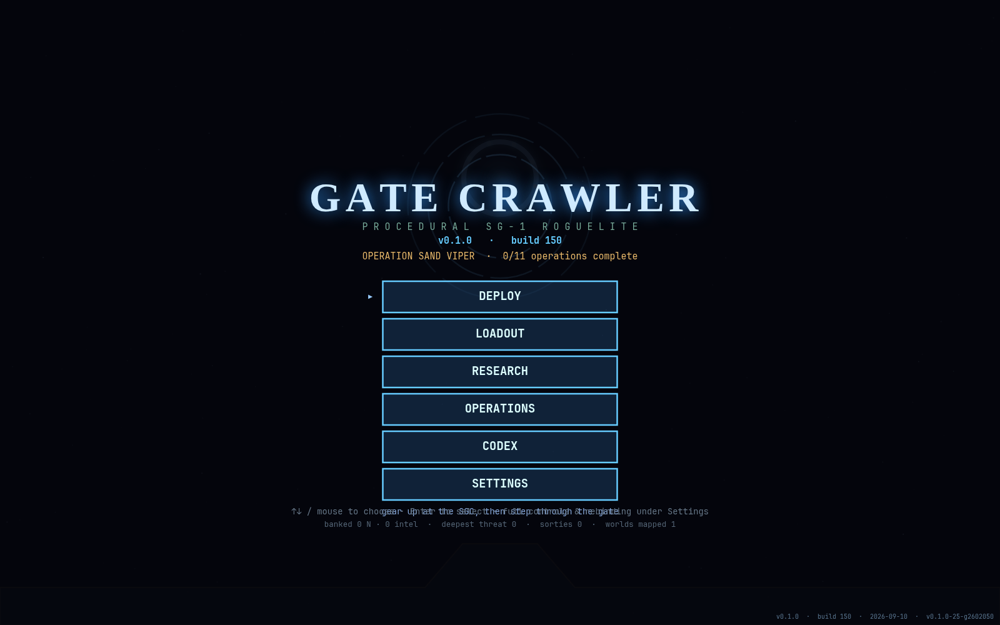
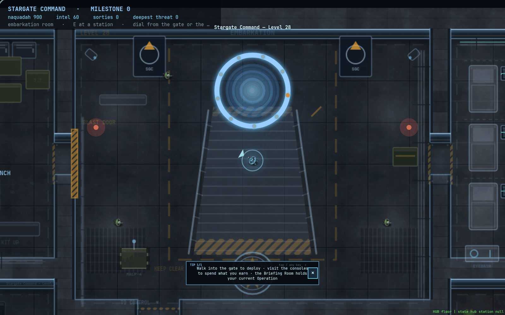
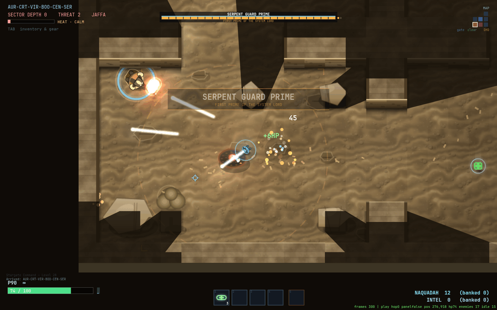
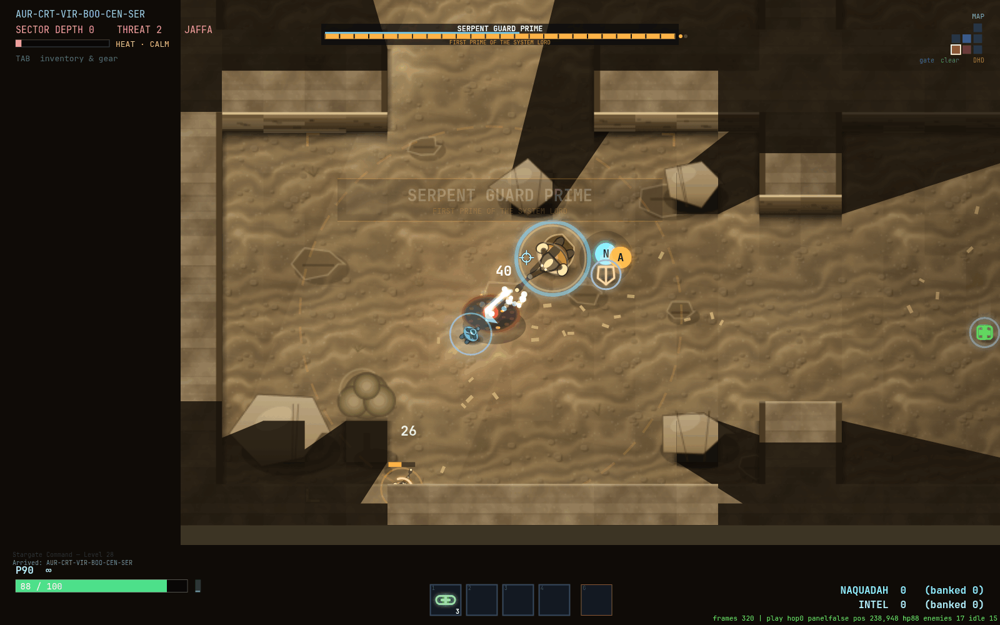
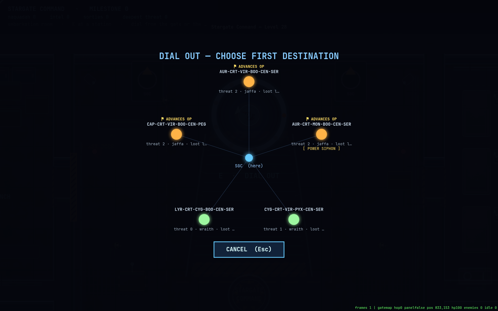

# Gate Crawler

**A procedural top-down twin-stick roguelite — dial a Stargate, fight a seeded world to its DHD, dial deeper for loot or dial home to bank it.**

▶ **[Play it in your browser](https://josh132.github.io/gatecrawler/)** — no install, works on desktop and phones.



## What it is

Gate Crawler is a from-scratch, vanilla-JavaScript canvas game — an unlicensed
_Stargate SG-1_ homage built on the HTML5 2D canvas with plain ES modules and
**no build step, no framework, no dependencies**. Clone it and open a file; that
is the whole toolchain. It runs in any modern browser, including phones and
tablets with on-screen twin-stick controls.

You play SG-1 out of Stargate Command, Level 28: gear up at the SGC, walk into
the gate, and push through an infinite, deterministically seeded gate network
one world at a time — Jaffa garrisons, Wraith hives, Replicator clusters —
recovering naquadah, intel and salvage to bring home.

## The premise — the Incursion

Something on the far side of the network is dialling gates on its own and
assimilating the worlds it reaches. Earth dials back. **The Incursion** is an
eleven-Operation campaign that walks you deeper into contested space act by act
— thinning Jaffa raids, breaking a Wraith hive, unmaking a Replicator nucleus —
until the route to the **Incursion Nexus** is mapped and survivable.

The Nexus is a gate that dials gates: the staging hub every incursion has been
run from. It sits at one fixed address at maximum threat, guarded by a construct
wearing all three factions at once. **Winning** means completing all eleven
Operations, then walking through that address and destroying the Nexus core in
its three-phase finale fight.

## How to play




### Desktop

| Action | Key |
|---|---|
| Move | `W` `A` `S` `D` |
| Aim | Mouse |
| Fire | Left mouse |
| Alt-fire (mod-unlocked, per weapon) | Right mouse |
| Dodge roll (i-frames) | `Space` |
| Reload | `R` |
| Throw grenade | `G` |
| Swap weapon | `X` / mouse wheel |
| Quick heal | `Q` |
| Inventory & stats | `Tab` / `I` |
| Interact / dial the DHD | `E` |
| Mute · volume | `M` · `[` `]` |
| Pause & settings (rebind keys here) | `Esc` |

### Mobile

Touch the left half of the screen anywhere for a floating **movement stick**;
the right half is a floating **aim stick** that auto-fires while held. Edge
buttons handle `ROLL` / `RLD` / `MED` on the right and `NADE` / `SWAP` / `USE`
on the left, with `❚❚` pause, `BAG` and `ALT` in the top corners. A
**FULLSCREEN** pill sits at the top; the game is landscape-only, so a portrait
phone shows a "rotate your device" scrim, and first-run tips can be dismissed
with **SKIP TIPS**. Every panel has an on-screen **✕** to close it — there is
no `Esc` on a phone.

### The loop

- **Hub.** Spend naquadah / intel / salvage at the SGC — research, loadout,
  base upgrades, rescued teams — then walk into the gate.
- **Dial.** The gate map shows seeded neighbour worlds with their threat,
  faction and loot rating; Operations flag the worlds that advance them.
- **Clear.** Fight room to room. Enemies wander until they see, hear or feel a
  fight; line of sight is a cast visibility polygon, so fire comes from the dark.
- **DHD boss.** The far room holds a faction boss on the Dial-Home Device.
  Encounters roll one of three types — standard, **siege** (reinforcements keep
  arriving until you dial out), or **vanguard** (a buffed champion that pushes
  from the start).
- **Dial deeper or dial home.** Deeper means higher threat, better loot and a
  faster "hunt". Home banks your naquadah and ends the run. Death costs half
  your _unbanked_ naquadah — equipped gear is safe.

## Features




- **Infinite seeded gate network** — a world's neighbours, faction, biome,
  threat, modifiers and room graph are a pure function of its address plus hop
  distance, so any address always leads to the same worlds.
- **~10 hand-painted procedural biomes** — temple, pyramid, desert, jungle,
  savannah, Wraith hive, glacier, Replicator foundry, Atlantis city, catacomb.
- **Three factions with distinct AI** — Jaffa use cover and lean-fire (DHD
  guards push), Wraith rush, Replicators swarm and adapt.
- **World modifiers** reroll per world — eclipse, ion-storm, naquadah-rich,
  power-siphon, black-fog and more — so infinite worlds don't feel same-y.
- **69-node research tree** across five branches (Field Ops, Armory, Gate
  Science, Xenotech, SGC Support) with a mutually-exclusive keystone choice and
  campaign-milestone-gated nodes.
- **Weapon mastery + mods** — seven weapons (P90, Staff Weapon, Zat'nik'tel,
  shotgun, burst rifle, grenade launcher, ion beam) earn mastery XP; salvage
  fits mods, and a tier-2 mod unlocks that weapon's alt-fire.
- **Rescuable SG teams** — bring captured teams home for permanent passives;
  spend naquadah on base upgrades (infirmary, training range, salvage foundry…).
- **Difficulty modes** — story / normal / hard, combat-and-HP tuning only,
  never worldgen.
- **11-Operation Incursion campaign** with a three-phase Nexus finale boss.
- **Hand-synthesised audio** — every sound effect built from oscillators, plus
  per-biome ambient beds and a slow-evolving reactive music drone. No audio
  files.

## Run it locally

```sh
git clone https://github.com/Josh132/gatecrawler.git
cd gatecrawler
python3 server.py            # serves on http://127.0.0.1:8777
```

Then open <http://localhost:8777> (`GATECRAWLER_PORT` overrides the port). Any
static file server works — `server.py` is just a zero-config `http.server`
wrapper that adds no-cache headers.

## Development

There is no build step and there are no dependencies. `index.html` loads
`src/main.js` as a module and everything else is `import`ed from there; edit a
file and reload.

```sh
npm test                     # node test/harness.mjs — headless worldgen +
                             # determinism + a full bot play-through, ~48k asserts
npm run lint                 # node scripts/lint.mjs
npm run sweep                # the harness across ten fixed seeds
npm run stamp                # regenerate the version stamp from git
npm run hooks                # install the pre-push hook (stamp must be fresh)
```

- **Architecture** is documented in [`ARCHITECTURE.md`](ARCHITECTURE.md) — the
  module map, the long-lived `g` game object, the data flow of a run, and the
  invariants the harness enforces (only five `g.state` values; every other
  screen is a sub-mode flag; worldgen is seeded and never calls `Math.random`).
- **`src/game.js`** is the large core file but it is sectioned: its header
  comment is a table of contents, and you jump to a section by searching its
  `// ▸ ` marker (`// ▸ combat`, `// ▸ enemy AI`, `// ▸ render`, …). Prefer
  landing a change in a sibling module (`fx.js`, `vis.js`, `weapons.js`,
  `worldgen.js`, `campaign.js`, …) when it fits one.
- **Screenshots** are taken headless via `test/play-shot.html` (query params
  `?nofx`, `?hub`, `?f=<frames>`, `?panel`).

## Credits / disclaimer

Unofficial fan project. _Stargate_, _Stargate SG-1_ and all related names,
marks and concepts belong to Metro-Goldwyn-Mayer Studios Inc. and their
respective owners; this project is not affiliated with, endorsed by, or
sponsored by them, and it is non-commercial. All source code is the author's
own.
